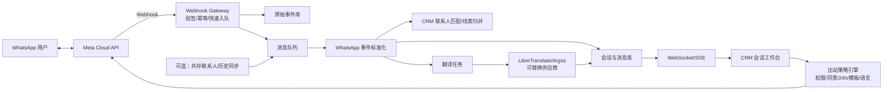

# WhatsApp 外贸社媒 CRM 插件可行性报告

> 状态说明：本报告保留为官方能力与合规调研依据。2026-07-16 用户已将实施决策调整为“默认 Baileys 免费非官方通道，同时提供 Meta 官方可选通道”，最新开发范围、代码审查和执行步骤以 [`Evolution插件代码分析与执行方案.md`](./Evolution插件代码分析与执行方案.md) 为准。

版本：1.0  
调研日期：2026-07-15  
适用对象：自建 CRM、外贸销售/客服团队  
调研范围：Meta 官方 WhatsApp Business Platform、官方共存接入、Evolution API、免费/自托管翻译方案

> 说明：本报告是产品与技术可行性建议，不替代当地法律、隐私或软件许可证法律意见。Meta 政策和价格会变更，上线前需再次核验。

## 1. 结论摘要

项目总体**可行**，但需求需要拆成三类判断：

| 需求 | 可行性 | 结论 |
| --- | --- | --- |
| CRM 内双向收发 WhatsApp 消息 | 可行 | Meta Cloud API 官方支持，发送走消息 API，接收和状态走 Webhook |
| 实时看到客户新消息 | 可行 | Webhook 入站后通过 WebSocket/SSE 推送到 CRM |
| 自动翻译 | 可行 | WhatsApp 不提供通用翻译 API，需接入独立翻译服务；可先自托管 LibreTranslate/Argos 降低调用费 |
| 保持账号在线/登录状态 | 可行，但实现方式不同 | 官方 Cloud API 是服务端令牌 + Webhook，不依赖浏览器常开或扫码会话；共存模式下 WhatsApp Business App 可继续使用 |
| CRM 线索按手机号联系客户 | 有条件可行 | 必须有有效手机号、用户同意；24 小时窗口外只能发送已审核模板，不能将 CRM 冷线索直接自由群发 |
| 自动获取完整通讯录 | 标准 Cloud API 不支持；官方共存模式有条件支持 | 共存接入可同步 WhatsApp Business App 中具有 WhatsApp 号码的联系人，但要求 Tech Provider/Solution Partner、Embedded Signup 和商家授权 |
| 同步登录前历史聊天 | 标准 Cloud API 不支持；官方共存模式有条件支持 | 共存模式可同步最近 180 天的一对一消息；群聊不含，历史媒体素材编号主要限同步查询附近最近约 14 天 |
| 使用 Evolution API 免费接入 | 技术可行，生产风险高 | Baileys 路线基于 WhatsApp Web、非 Meta 官方接口；存在封号、协议变更、合规和安全风险，不建议作为生产主通道 |

最终建议：

1. **生产主方案：Meta 官方 Cloud API + 自建 CRM Connector + 独立翻译服务。**
2. **必须保留现有 WhatsApp Business App、同步联系人和历史时：走官方“共存”接入。** 从第一天按 Embedded Signup v4 设计，因为 v2 将于 2026-10-15 停用。
3. **Evolution API 只作为代码和接口设计参考，或仅使用其官方 Cloud API 通道。** 不把 Baileys 免费通道作为关键客户号码的长期基础设施。
4. “零软件授权费”可以做到，“完全零成本且合规”做不到。服务器、存储、运维仍有成本；部分模板消息按国家/地区和类别收费。

项目决策为：**官方方案 GO；官方共存方案 Conditional GO；Baileys 生产方案 NO-GO。**

## 2. 官方 API 能力核验

### 2.1 标准 WhatsApp Cloud API

Meta 官方平台支持：

- 使用 `POST /<PHONE_NUMBER_ID>/messages` 向用户发送文本、图片、文档、音频、互动消息和模板消息。
- 入站消息、发送/送达/已读/失败状态通过 `messages` Webhook 通知业务服务器。
- 入站 Webhook 包含发送者 `wa_id`、`profile.name`、消息 ID、时间、类型和内容，可用于 CRM 联系人匹配和会话展示。
- 使用 System User Access Token 进行服务端调用。Meta 对直接开发者的官方建议是使用系统用户访问令牌。
- 通过测试 WABA 和测试电话号码完成 PoC，不必先拿正式号码验证全部链路。

这不是 WhatsApp Web 的“扫码登录插件”。生产系统不需要保持浏览器页面在线，账号在线能力由 Meta Cloud API 承担；本系统需要维护的是令牌、号码资源、Webhook 健康和连接状态。

### 2.2 24 小时窗口、模板和用户同意

当 WhatsApp 用户给企业号码发消息或发起通话时，会开启/重置 24 小时客户服务窗口：

- 窗口内可以发送自由格式服务消息。
- 窗口外只能发送已审核模板消息。
- 联系 CRM 线索前必须取得用户的手机号和明确的 WhatsApp 接收同意。
- 同意应记录业务名称、消息类别、来源、时间和退出方式；联系人同步不等于营销同意。
- 用户退订后必须停止联系，并加入抑制名单。

因此，“从 CRM 线索直接联系潜客”可实现，但不能设计成无同意冷启动群发。系统必须内置发送策略引擎，而不是只做一个 `sendText` 按钮。

### 2.3 标准 Cloud API 的联系人边界

标准 Cloud API 没有“读取账号全部通讯录”的通用接口。它能获得：

- 给企业发过消息的用户的 `wa_id` 和资料名称；
- CRM 已有手机号对应的发送结果和 WhatsApp 用户 ID；
- 用户主动发送的联系人卡片内容。

它不能像手机 App 一样任意枚举个人/Business App 的完整联系人列表，也不能任意拉取接入前历史聊天。

### 2.4 官方共存接入：满足通讯录和历史需求的条件方案

Meta 当前提供 WhatsApp Business App 与 Cloud API 的“共存”接入：

- 商家保留现有 WhatsApp Business App 和号码，可继续在 App 中一对一聊天。
- Cloud API 与 Business App 之间镜像接入后的收发消息。
- 可同步 Business App 中所有具有 WhatsApp 电话号码的联系人。
- 商家允许共享聊天记录时，可同步最近 180 天的一对一聊天。
- 可通过 `smb_app_state_sync` Webhook 接收联系人新增、编辑和删除。
- 可通过 `smb_message_echoes` 接收商家在 Business App/支持设备上发出的消息。
- 通过 `POST /<BUSINESS_PHONE_NUMBER_ID>/smb_app_data`，分别以 `sync_type=smb_app_state_sync` 和 `sync_type=history` 发起联系人、历史同步。

限制和准入：

- 接入方必须是 Meta Solution Partner 或 Tech Provider。
- Tech Provider 需要企业验证、应用审核，以及 `whatsapp_business_messaging`、`whatsapp_business_management` 高级访问权。
- 商家 Business App 需为 2.24.17 或更高版本，并在接入流程中授权。
- Embedded Signup v2 将于 2026-10-15 停用，新项目应直接采用 v4。
- 共存号码固定吞吐量为 20 messages/s。
- 群聊不进行历史同步。
- 180 天历史中的媒体消息限制更多；媒体素材编号主要只覆盖同步查询/接入时点附近最近约 14 天的消息，实施时应以测试账号返回为准。
- 历史 Webhook 可能包含大量消息并分块、乱序送达，必须先持久化再异步处理，并按 `phase`、`chunk_order`、`progress` 追踪。
- 某些 Business App 功能在 Cloud API 侧不支持，广播列表等 App 功能也会受影响。

结论：用户提出的“登录后同步通讯录、保留原 App、同步历史”已经有官方可行路径，但它不是普通私有插件开一个 API Key 就能完成的功能，准入和开发成本明显高于标准 Cloud API。

## 3. Evolution API 评估

评估仓库：[evolution-foundation/evolution-api](https://github.com/evolution-foundation/evolution-api)  
评估基线：`main` 分支（2026-07-14 仍有提交），最新稳定发布 `2.3.7`（2025-12-05）

### 3.1 符合需求的能力

Evolution API 同时支持两种 WhatsApp 通道：

- `WHATSAPP-BAILEYS`：基于 Baileys/WhatsApp Web，二维码或配对码连接。
- `WHATSAPP-BUSINESS`：Meta 官方 WhatsApp Cloud API。

代码中已有：

- 实例创建、二维码连接、连接状态、重启、登出和删除；
- `alwaysOnline`、`syncFullHistory` 等实例设置；
- `findContacts`、`findChats`、`findMessages`、号码检查和资料查询；
- 文本、模板、媒体、联系人、位置等发送接口；
- `messages.upsert`、`contacts.upsert`、`connection.update`、`messaging-history.set` 等事件；
- Webhook、WebSocket、RabbitMQ、Kafka、SQS、NATS 等事件输出；
- PostgreSQL/MySQL、Redis、S3/MinIO、Chatwoot 等集成。

从“快速做出能扫码、保持状态、读联系人、实时收消息的原型”看，Baileys 路线非常接近用户的初始描述。

### 3.2 不满足或需要二次开发的部分

- Evolution API 没有现成的通用消息自动翻译模块；其 OpenAI/聊天机器人能力不能直接等同于双向翻译工作台。
- 当前仓库未发现官方共存数据事件 `smb_app_state_sync`、`smb_message_echoes` 或 `smb_app_data` 同步实现。若要走官方共存，仍需扩展 Meta 通道适配器。
- API 主要是全局/实例 `apikey` 鉴权，不等同于 CRM 的组织、角色、坐席和数据权限模型。
- 需要自己补充幂等、消息窗口、同意/退订、模板审批、翻译审计、CRM 联系人去重和人工合并流程。

### 3.3 许可证与安全注意事项

仓库许可证不是无附加条件的纯 Apache-2.0。其 LICENSE 是 Apache-2.0 加附加条件：

- 使用前端组件时不得移除/修改 Evolution LOGO 和版权信息；
- 包含在闭源系统中也需要在系统管理界面或文档明确提示正在使用 Evolution API；
- 不满足附加条件时，作者保留要求商业许可证的权利；
- GitHub 将其识别为 `Other`，正式商用前应由法务确认。

其他安全要点：

- README 说明默认收集匿名遥测；企业环境应评审并将 `TELEMETRY_ENABLED=false`。
- 官方安全策略只承诺最新版本的安全更新，应锁定版本并制定升级窗口，不能长期运行旧镜像。
- Evolution API 不应直接暴露公网管理接口；应放在私有网络/API Gateway 后，API Key 放密钥系统，CRM 浏览器端绝不持有该 Key。
- 需要限制管理路由、媒体大小、Webhook 目标地址和出站网络，避免 SSRF、密钥泄漏和大文件资源耗尽。

### 3.4 Baileys 免费通道的生产风险

Baileys 路线不使用 Meta 官方 Business API，而是模拟/复用 WhatsApp Web 协议：

- Meta 官方文档明确禁止未经授权的第三方工具；
- WhatsApp Web 协议或设备识别变更会导致连接中断，需要持续追版本；
- 高频自动化可能触发风控、质量下降或号码限制；
- 多设备状态、历史同步和消息顺序可能随上游变化；
- 业务关键号码一旦受限，销售历史和客户沟通会受影响。

因此它可以作为架构参考，不能把“没有 Meta 消息费”理解为“免费且稳定的官方接口”。

### 3.5 对 Evolution API 的采用建议

推荐优先级：

1. **最佳：自建轻量 Connector 直连 Meta Cloud API。** 代码面最小，合规边界清楚，容易按 CRM 领域模型设计。
2. **可选：Evolution API 作为内部 Sidecar，但只启用官方 Cloud API 通道。** 需要关闭未用集成、加强鉴权、禁遥测、固定镜像版本、保留许可证提示。
3. **不建议：关键生产号码使用 Baileys。** 若管理层仍坚持验证，只能作为明确标注“非官方、不可承诺账号安全”的隔离技术实验，不使用真实客户数据，也不能据此通过生产验收。

### 3.6 GitHub 同类项目横向筛选

| 项目 | 接入方式 | 符合的需求 | 缺口/成本 | 结论 |
| --- | --- | --- | --- | --- |
| [Evolution API](https://github.com/evolution-foundation/evolution-api) | Baileys + Meta Cloud API | 二维码/连接状态、联系人/聊天/消息、实时事件、官方通道、数据库和队列集成 | 无现成通用翻译；官方共存事件需开发；自定义许可证；Baileys 非官方 | **最适合做连接器参考**；生产只选官方通道 |
| [WAHA](https://github.com/devlikeapro/waha) | WEBJS/NOWEB/GOWS，均为 WhatsApp Web 类引擎 | REST、二维码会话、联系人/聊天/消息、Webhook，Core 可自托管 | 非 Meta 官方；部分多会话/高级能力属于 Plus；无本需求所需的双向翻译 | 技术上匹配免费原型，**不通过生产合规门槛** |
| [WPPConnect Server](https://github.com/wppconnect-team/wppconnect-server) | Puppeteer/Chrome 驱动 WhatsApp Web | 多会话、通讯录、收发、Webhook、会话重启，Apache-2.0 | 非官方且浏览器资源占用高；配置面较大；无自动翻译 | 可参考接口，不选作生产连接器 |
| [Chatwoot](https://github.com/chatwoot/chatwoot) | 支持 Meta Cloud API 的完整客服平台 | 官方 WhatsApp 收件箱、多坐席、联系人、会话、实时翻译交互参考 | 是独立客服/CRM 产品而非轻量插件；标准 Cloud API 仍不能枚举通讯录；Google 翻译会有调用成本；核心/企业代码许可证不同 | 适合参考 UI/会话模型，或作为独立客服台；不直接嵌入现有 CRM 核心 |
| [Baileys](https://github.com/WhiskeySockets/Baileys) / [whatsapp-web.js](https://github.com/wwebjs/whatsapp-web.js) | 底层 WhatsApp Web 库 | 可自行实现扫码、消息和联系人 | 需要从头补 API、存储、安全、队列、运维；同样非官方 | 不重复造 Evolution/WAHA 已封装的能力，更不用于关键生产号码 |

筛选结论：若目标是“免费原型”，Evolution 和 WAHA 的功能覆盖最好；若目标是“长期稳定、合规生产”，GitHub 项目不能替代 Meta 官方通道。开源项目的正确价值是缩短连接器、消息模型和收件箱设计时间，不是绕开官方政策。

## 4. 推荐总体架构



建议把“插件”实现为 CRM 内的渠道模块，而不是浏览器扩展：

- 前端：CRM 会话工作台、联系人绑定、翻译预览和账号状态。
- 后端：WhatsApp Connector、Webhook、策略引擎、翻译编排和事件推送。
- 数据层：消息原文/译文、联系人渠道身份、同意证据、模板、状态和审计。
- 可选适配层：Meta Direct、Evolution Official、其他社媒渠道，统一为 CRM Channel Provider 接口。

### 4.1 核心模块

| 模块 | 主要职责 |
| --- | --- |
| 账号管理 | WABA/号码绑定、令牌引用、Webhook 状态、质量和配额告警 |
| Webhook Gateway | GET 验证、`X-Hub-Signature-256` HMAC 校验、原始事件持久化、幂等和快速确认 |
| 消息标准化 | 将 Meta/Evolution 事件转成统一 `MessageEvent`，处理状态机和乱序事件 |
| 联系人匹配 | E.164 标准化、`wa_id` 映射、CRM 线索去重、候选合并和人工复核 |
| 会话服务 | 收件箱、未读、坐席、标签、内部备注、分配、检索和审计 |
| 翻译服务 | 语言检测、原文/译文双存、术语表、失败重试、人工编辑后发送 |
| 出站策略 | 同意、退订、24 小时窗口、模板类别、坐席权限、频控和审批 |
| 实时推送 | WebSocket/SSE 向在线坐席推送消息和状态，不依赖前端轮询 |
| 共存导入 | 联系人/180 天历史分块导入、进度、去重、错误隔离和重放 |

### 4.2 最小数据模型

| 表/实体 | 关键字段 |
| --- | --- |
| `channel_accounts` | `provider`、`waba_id`、`phone_number_id`、`credential_ref`、`status` |
| `contact_channels` | `crm_contact_id`、`wa_id`、`e164`、`profile_name`、`source`、`match_status` |
| `contact_consents` | `contact_id`、`category`、`source`、`granted_at`、`revoked_at`、`evidence_ref` |
| `conversations` | `account_id`、`contact_channel_id`、`owner_id`、`last_customer_message_at`、`window_expires_at` |
| `messages` | `wa_message_id`、`direction`、`type`、`original_text`、`translated_text`、`status`、`sent_at` |
| `webhook_events` | `event_hash`、`payload_ref`、`received_at`、`processed_at`、`error` |
| `translation_jobs` | `message_id`、`source_lang`、`target_lang`、`provider`、`latency`、`status` |
| `message_templates` | `meta_template_id`、`name`、`language`、`category`、`approval_status` |

数据库约束至少包括：`wa_message_id` 唯一、`(account_id, wa_id)` 唯一、Webhook 幂等键唯一、联系人手机号标准化索引。

## 5. 自动翻译方案

WhatsApp 官方 API 只传递消息内容，不提供通用自动翻译。推荐增加 `TranslationProvider` 接口：

```text
detect(text) -> language, confidence
translate(text, sourceLanguage, targetLanguage, glossary) -> translatedText
```

### 5.1 免费优先方案

| 方案 | 费用 | 许可证/部署 | 适用性 |
| --- | --- | --- | --- |
| LibreTranslate | 无按次 API 费，自付服务器 | AGPL-3.0，自托管 REST API，底层使用 Argos | PoC 和低量文本最方便；作为独立服务部署并履行许可证义务 |
| Argos Translate | 无按次 API 费，自付服务器 | MIT，离线 Python 库，需要自建轻量 API | 许可证更宽松，开发工作略多，质量需按目标语种测试 |
| 商业翻译 API | 按量收费 | 第三方 SaaS | 质量、语种和 SLA 通常更好，可作为后续可切换供应商 |

推荐初期使用独立 LibreTranslate 容器验证流程，但在选型评审中同时测试 Argos 直连。不要把翻译进程嵌在 CRM Web 进程中，以免模型加载和长请求拖垮业务接口。

### 5.2 翻译交互要求

- 入站消息同时展示原文和中文译文，原文不可被覆盖。
- 出站时坐席写中文，系统生成目标语言草稿；坐席可编辑并确认后发送。
- 自动回复默认只对低风险固定场景开放；报价、付款、交期、合同等内容必须人工确认。
- 保存使用的提供商、语言、耗时和失败原因，不保存不必要的模型日志。
- 客户名称、邮箱、电话等 PII 发送到第三方翻译前应脱敏；自托管翻译也要设置访问控制和日志保留期限。
- 建立外贸术语表、产品名和品牌词“不翻译”清单。

## 6. 最低成本的合规路线

“免费优先”建议这样实现：

1. 直接注册 Meta 开发者应用和 Cloud API，不购买 BSP 的月订阅。
2. 用官方测试 WABA/号码完成 PoC。
3. 让客户从网站 WhatsApp 按钮、邮件签名、二维码或表单主动发起会话，并记录同意。
4. 用户发起后，24 小时窗口内的非模板服务消息免费；当前官方定价页说明入站消息免费、窗口内非模板消息免费、窗口内实用型模板免费。
5. 窗口外只发送确有必要的实用型/营销模板；营销模板始终收费，费率按收信人国家/地区和类别变化。
6. 翻译先自托管 LibreTranslate/Argos，不产生按次翻译费。
7. 用现有 CRM 数据库和消息队列；低量阶段不单独引入 Kafka，优先复用现有任务队列。

注意：Meta 已从 2025-07-01 改为按消息计费，价格最多按季度调整。2026-07-01 已有新一轮地区价格更新，预算不能写死单价，应按目标国家、模板类别和预计月量从官方费率表动态测算。

### 6.1 成本组成

| 成本 | 是否可避免 | 说明 |
| --- | --- | --- |
| Meta API 软件接入费 | 可 | 直接使用 Cloud API 不必购买第三方软件订阅 |
| Meta 模板消息费 | 不完全可 | 通过用户主动发起和 24 小时服务窗口降低，但外呼模板仍可能收费 |
| 服务器/数据库/带宽 | 不可 | 即使开源自托管也有基础设施成本 |
| 翻译调用费 | 可先避免 | 自托管开源模型无按次费，但有 CPU/内存和运维成本 |
| Meta 企业验证/应用审核 | 主要是时间成本 | 共存和 Tech Provider 路线的周期不可完全控制 |
| Evolution 商业许可证 | 可避免 | 不使用前端或严格遵守附加条件；正式商用仍需法务确认 |

## 7. CRM 业务流程

### 7.1 入站消息

1. Meta 向 Webhook 推送消息。
2. Gateway 验签、生成幂等键、保存原始 Payload 并入队。
3. 标准化 `wa_id` 和 E.164 电话号。
4. 匹配唯一 CRM 联系人；无匹配则进入“待建联系人”，多匹配则人工合并。
5. 保存原文，异步检测语言和翻译。
6. 推送到 CRM 收件箱，更新未读数、负责人和 24 小时窗口。

### 7.2 CRM 出站

1. 坐席选择联系人和 WhatsApp 号码。
2. 系统检查退订、同意、号码质量、窗口状态和坐席权限。
3. 窗口内允许服务消息；窗口外只能选已批准模板。
4. 生成目标语言译文，坐席确认。
5. 调用 Cloud API，保存返回的 `wamid`。
6. 由 Webhook 更新 sent/delivered/read/failed，不能把 HTTP 200 当作已送达。

对于超时或连接中断的出站请求，不能盲目自动重放，因为上游可能已经接受请求，重放会造成重复消息。只有能确认未受理时才重试；不确定状态进入人工核对队列。

### 7.3 联系人同步与自动建档

- 标准 Cloud API：只把真实入站/出站交互产生的用户加入候选联系人。
- 共存模式：联系人同步先进入导入暂存区，不直接覆盖 CRM 主数据。
- E.164 唯一且只有一个 CRM 候选时可自动关联。
- 姓名相近但号码不同、一个号码对应多条线索时必须人工复核。
- 自动创建的联系人标记来源 `whatsapp_coexistence`，同意状态默认为“未知”，禁止自动营销。
- 联系人从 Business App 删除时，CRM 不物理删除历史客户，只解除同步映射并保留审计。

## 8. 安全、隐私与可靠性

### 8.1 安全基线

- Webhook GET 使用 verify token 验证订阅；POST 使用应用密钥校验 `X-Hub-Signature-256` HMAC-SHA256。
- Meta Token、Evolution API Key、翻译 Key 只存密钥系统，数据库仅存 `credential_ref`。
- 浏览器端只调用 CRM 后端，绝不直连 Meta/Evolution 管理 API。
- 账号、会话、联系人和消息按组织/坐席做 RBAC 与行级权限。
- 敏感字段加密，日志默认脱敏，不记录完整 Token、Cookie 或消息正文。
- 媒体使用受控对象存储、短期签名 URL、类型和大小校验、恶意文件扫描。
- 所有联系人导入、合并、外呼、翻译和模板发送写审计日志。

### 8.2 可靠性基线

- Webhook 在事件已持久化/入队后立即返回，不同步等待翻译或 CRM 复杂逻辑。
- 使用 `wamid` 和事件哈希去重，允许 Meta 重复投递。
- 消息状态使用单向状态机，处理状态 Webhook 乱序。
- 共存历史按 chunk 落库，可重放、可断点续传，不能把一个巨大 Webhook 放在内存中一次处理。
- 翻译失败不阻塞原文展示；消息先可见，译文稍后补齐。
- 监控 Webhook 延迟、积压、翻译失败率、发送失败率、账号质量、模板状态和令牌错误。
- 配置停发开关：异常时停止自动出站，保留入站和人工处理。

## 9. 实施阶段与工期

工期按已有 CRM 提供稳定后端扩展点、1 名后端 + 1 名前端 + 兼职测试估算；Meta 审核时间不计入可控开发工期。

| 阶段 | 范围 | 预计时间 | 交付物 |
| --- | --- | --- | --- |
| 0. 技术 PoC | 测试号码、Webhook、收发文本、状态回执 | 3-5 个工作日 | 官方链路可用证明 |
| 1. Connector MVP | 账号、适配层、幂等、消息库、错误处理 | 1.5-2 周 | 后端渠道服务 |
| 2. CRM 会话工作台 | 收件箱、实时推送、联系人匹配、坐席回复 | 2-3 周 | 可用 CRM WhatsApp 工作台 |
| 3. 翻译与合规 | 双向翻译、同意、退订、模板和 24h 策略 | 1.5-2 周 | 可控外呼和翻译闭环 |
| 4. 生产加固 | RBAC、审计、监控、备份、压测、灰度 | 1-2 周 | 生产发布候选 |
| 5. 可选共存 | Embedded Signup v4、联系人/历史/echo 同步 | 3-6 周 + Meta 审核 | 共存导入与双端消息镜像 |

标准 Cloud API MVP 预计 6-9 周；加入共存后预计 9-15 周，并受企业验证和应用审核影响。

## 10. 验收标准

### 10.1 P0 验收

- 服务重启后无需人工打开 WhatsApp Web，Cloud API 收发能力恢复。
- 入站文本在 Webhook 到达后 3 秒内出现在 CRM（内部 p95 目标，不含公网/Meta 异常）。
- 500 字以内文本翻译在 5 秒内补齐（p95，按选定硬件基准调整）。
- 相同 Webhook 重放 10 次，CRM 只生成 1 条消息。
- 出站消息展示 accepted/sent/delivered/read/failed，不把 accepted 误标为 delivered。
- 24 小时窗口外自由文本被系统阻止，只允许批准模板。
- 已退订联系人不能发送任何非必要消息。
- 原文永久保留，翻译失败时仍可正常查看和回复。
- API Key/Token 不出现在浏览器请求、前端包或普通日志中。

### 10.2 共存验收

- 联系人同步可处理新增、编辑、删除事件，重复导入不重复建档。
- 180 天历史按阶段和块完整导入，乱序到达仍能正确恢复。
- App 端发送的消息通过 `smb_message_echoes` 出现在 CRM。
- 群聊明确标记为“不在同步范围”，不产生误导。
- 商家拒绝历史共享时，系统降级为接入后实时消息，不阻塞账号使用。

## 11. 主要风险与应对

| 风险 | 等级 | 应对 |
| --- | --- | --- |
| Baileys 号码限制/协议失效 | 高 | 生产禁用 Baileys；关键号码只走官方 API |
| 共存准入和审核周期 | 高 | 先交付标准 Cloud API；共存独立里程碑；从 v4 开始 |
| 冷线索外呼违规 | 高 | 强制同意证据、24h/模板策略、退订抑制和频控 |
| 翻译错误导致商务损失 | 高 | 原文双显、重要内容人工确认、术语表和低置信度提示 |
| Webhook 重复/乱序 | 中高 | 原始事件库、幂等键、状态机、可重放队列 |
| 消息超时重试造成重复发送 | 中高 | 不确定受理状态不自动重放，进入核对队列 |
| 客户数据发送第三方翻译 | 高 | 默认自托管或脱敏；DPA、区域和保留策略评审 |
| Evolution 许可证附加条件 | 中 | 法务评审、管理员可见提示、保留 NOTICE/品牌要求 |
| Evolution 攻击面过大 | 中高 | 仅内网部署、关闭未用功能/遥测、API Gateway、固定版本 |
| Meta 价格变化 | 中 | 按国家/类别动态测算，季度复核，不在代码写死价格 |

## 12. 最终推荐方案

### 推荐方案 A：低成本、合规、最快上线

- 自建轻量 WhatsApp Connector，直连 Meta Cloud API。
- 使用新的/正式业务号码或按 Meta 流程迁移号码。
- CRM 按 `wa_id + E.164` 匹配线索。
- Webhook + 队列 + WebSocket/SSE 实现实时收件。
- 自托管 LibreTranslate/Argos，实现可切换翻译适配器。
- 通过客户主动发起提高 24 小时窗口内免费服务消息占比。
- 暂不承诺导入完整通讯录和接入前历史。

### 推荐方案 B：必须读取现有 Business App 联系人和历史

- 在方案 A 基础上申请 Tech Provider/Solution Partner 条件。
- 使用 Embedded Signup v4 接入现有 WhatsApp Business App 号码。
- 直接实现 Meta `smb_app_data`、`history`、`smb_app_state_sync`、`smb_message_echoes`。
- 联系人和历史先进入暂存导入流程，再与 CRM 主数据合并。
- Evolution 当前代码可参考事件架构，但不能替代这部分官方共存开发。

### 不推荐方案 C：Evolution Baileys 作为生产主通道

虽然最接近“扫码登录、免费、同步通讯录”的表面需求，但它不具备官方长期支持与账号安全保证。对于外贸 CRM，客户号码和聊天历史属于核心业务资产，节省消息费不足以覆盖号码受限、数据中断和持续追协议的风险。

## 13. 下一步决策清单

在开始代码实施前，需要确认：

1. 现有 CRM 的后端语言/框架、数据库、部署方式、队列和实时推送能力。
2. 使用新号码、现有 WhatsApp Business App 号码，还是多个号码。
3. 是否把“同步现有通讯录和 180 天历史”列为首期硬性需求。
4. 目标国家、预计月消息量、模板消息比例、坐席数量和语种。
5. 是否愿意申请 Tech Provider，或选择已支持共存的官方合作伙伴。
6. 翻译数据是否允许离开自有服务器，及需要支持的语种和术语。
7. 数据保留期、删除请求、导出和坐席权限规则。

若首期目标是快速验证，建议直接从方案 A 的 Meta 测试号码 PoC 开始；该路线不会阻塞后续升级到共存。

## 14. 参考资料

### Meta/WhatsApp 官方

- [WhatsApp Business Platform 简介](https://developers.facebook.com/documentation/business-messaging/whatsapp/about-the-platform)
- [服务消息与 24 小时客户服务窗口](https://developers.facebook.com/documentation/business-messaging/whatsapp/messages/send-messages)
- [消息 Webhook 参考](https://developers.facebook.com/documentation/business-messaging/whatsapp/webhooks/reference/messages)
- [创建 Webhook 端点与签名校验](https://developers.facebook.com/documentation/business-messaging/whatsapp/webhooks/create-webhook-endpoint)
- [访问令牌指南](https://developers.facebook.com/documentation/business-messaging/whatsapp/access-tokens)
- [WhatsApp Business App 用户共存接入](https://developers.facebook.com/documentation/business-messaging/whatsapp/embedded-signup/onboarding-business-app-users)
- [history Webhook 参考](https://developers.facebook.com/documentation/business-messaging/whatsapp/webhooks/reference/history)
- [成为 Tech Provider](https://developers.facebook.com/documentation/business-messaging/whatsapp/solution-providers/get-started-for-tech-providers)
- [获取 WhatsApp 消息接收同意](https://developers.facebook.com/documentation/business-messaging/whatsapp/getting-opt-in)
- [WhatsApp Business Platform 定价](https://developers.facebook.com/documentation/business-messaging/whatsapp/pricing)
- [WhatsApp Business Messaging Policy](https://whatsappbusiness.com/policy/)

### 开源项目

- [Evolution API](https://github.com/evolution-foundation/evolution-api)
- [Evolution API LICENSE](https://github.com/evolution-foundation/evolution-api/blob/main/LICENSE)
- [WAHA](https://github.com/devlikeapro/waha)
- [WPPConnect Server](https://github.com/wppconnect-team/wppconnect-server)
- [Chatwoot](https://github.com/chatwoot/chatwoot)
- [Baileys](https://github.com/WhiskeySockets/Baileys)
- [whatsapp-web.js](https://github.com/wwebjs/whatsapp-web.js)
- [LibreTranslate](https://github.com/LibreTranslate/LibreTranslate)
- [Argos Translate](https://github.com/argosopentech/argos-translate)
