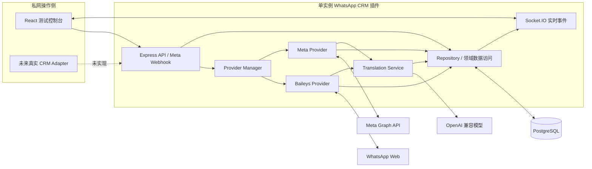
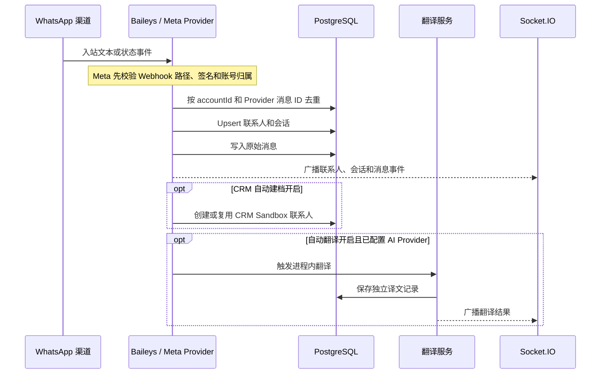

# WhatsApp CRM 插件架构说明

## 1. 文档定位

本文描述当前 `0.1.0` 版本的实际架构与生产边界。当前版本的准确定位是：

> 单租户、单实例、私网部署的生产候选版。

它已经具备独立插件控制台、Baileys 免费通道、Meta Cloud API 官方通道、联系人与会话、实时消息、AI 翻译、CRM Sandbox、PostgreSQL 生产配置约束和基础运维能力，但尚不满足公网多用户、多租户或多实例生产发布门禁。

“候选版”不代表已经通过真实生产环境验收。当前 PostgreSQL 驱动和 Meta 接口已实现，自动化测试也已覆盖关键契约，但目标 PostgreSQL、真实 Meta 凭据、两个真实 Baileys 账号的端到端验收仍待执行。

## 2. 架构目标

- WhatsApp 渠道与 CRM 领域模型解耦，CRM 不直接依赖 Baileys 或 Meta 请求格式。
- 免费和官方通道使用统一账号、联系人、会话、消息和翻译模型。
- 多账号的执行身份由 `accountId` 和会话归属决定，不能由前端当前筛选状态推断。
- 原始消息与译文分开保存，译文是可追溯的派生记录，不覆盖原文。
- 本机开发使用 PGlite，生产运行时强制使用 PostgreSQL。
- Demo 能力显式选择、可精确清理，并在生产配置中强制禁用。
- 关键外部依赖失败时提供可观测状态，不承诺 Baileys 永久在线或具备官方 SLA。

## 3. 逻辑组件

| 组件 | 当前职责 | 生产边界 |
| --- | --- | --- |
| React 控制台 | 账号、联系人、会话、路由、接入方式、AI 与诊断操作 | 是独立测试控制台，不是带坐席权限的完整 CRM 前端 |
| Express API | 参数校验、领域操作、Meta Webhook、生产静态资源托管 | 当前没有登录鉴权和 RBAC，只能置于受控私网或外部访问网关之后 |
| Socket.IO | 广播账号、联系人、消息、翻译和状态变化 | 当前为全局广播，没有租户 ACL 或账号房间 |
| Provider Manager | 根据持久化账号类型分派 Baileys、Meta 或开发 Demo Provider | Provider 身份由账号记录决定，不支持把已有账号原地改成另一 Provider |
| Baileys Provider | 二维码登录、AuthState、自动重连、联系人增量、双向文本和状态 | 非官方 WhatsApp Web 协议，无官方 SLA，协议变化或平台风控可导致中断 |
| Meta Provider | Graph 凭据校验、Webhook 验签、文本、模板和状态回执 | 标准 Cloud API 不枚举一般通讯录；官方 Business App Coexistence 未实现 |
| Translation Service | OpenAI 兼容翻译、自动/手动触发、译文持久化 | 当前在应用进程内执行，没有持久任务队列和崩溃后自动重放 |
| Repository | PostgreSQL 参数化 SQL、账号隔离、幂等和审计 | 当前没有 `tenant_id`，所有数据属于同一个逻辑租户 |
| CRM Sandbox | 手动添加、CRM 导入模拟、自动建档和去重 | 不是真实 CRM Adapter，不应直连真实 CRM 数据库 |

## 4. 运行时生命周期

### 4.1 启动

1. 严格解析环境变量；布尔值、端口、URL、数据库类型和主密钥格式不合法时直接失败。
2. 生产环境校验 PostgreSQL、32 字节 Base64 主密钥、Demo 禁用和官方 Meta Graph 地址。
3. 建立数据库连接。生产默认不自动迁移，发布流程必须先显式执行迁移。
4. 初始化无业务样本的系统默认记录。只有 `SEED_DEMO=true` 且 Demo Provider 已启用时才会单独生成 Demo 数据。
5. 创建加密、实时、翻译和 Provider 服务。
6. 恢复可恢复的 Baileys 与 Meta 账号连接，然后开始提供 HTTP 服务。

Provider 恢复是异步过程。`/api/health/ready` 只证明进程未关闭且数据库 `SELECT 1` 成功，不证明所有 WhatsApp 账号已经连接。

### 4.2 关闭

`SIGINT` 和 `SIGTERM` 触发幂等关闭流程：

1. 标记服务正在关闭，readiness 返回 `503`。
2. 停止接受新 HTTP 连接并关闭空闲连接。
3. 断开 Socket.IO 客户端。
4. 关闭 Provider 连接和代理资源。
5. 关闭数据库连接池。
6. 超过 30 秒仍未完成时强制断开连接并以失败状态退出。

当前关闭流程没有持久队列，也不跟踪所有 fire-and-forget 翻译任务。发布时应先停止新业务流量并等待短暂排空，不能把进程关闭等同于所有后台任务已经可靠完成。

## 5. 核心数据流

### 5.1 入站消息

Meta Webhook 使用原始请求体计算 HMAC-SHA256 签名，只有 App、WABA、Phone Number ID 和本地启用状态匹配时才处理新入站消息。账号暂停后仍可处理已有消息的迟到状态回执，但忽略新的业务消息。

Baileys 直接消费 WhatsApp Web 事件。联系人、会话、消息和 AuthState 都按账号分区；服务重启时从加密 AuthState 尝试恢复登录。

### 5.2 出站消息

1. 客户端必须提供 `accountId`、`conversationId` 和唯一 `clientMessageId`。
2. Provider 校验账号在线，并校验会话确实属于该账号。
3. 数据库通过 `(account_id, client_message_id)` 实现出站幂等占位。
4. Provider 调用对应渠道，更新 accepted、delivered、read、failed 或 unknown 状态。
5. Meta 自由文本受 24 小时客户服务窗口约束；窗口外必须使用已审核模板。

当前没有持久 Outbox。进程在渠道可能已接收、但本地尚未获得确定响应时崩溃，消息可能停留在 `unknown` 等不确定状态。运维人员必须人工核对，不能自动无条件重发。

### 5.3 联系人与 CRM 建档

- 联系人以 `(account_id, phone)` 和 `(account_id, provider_contact_id)` 约束去重。
- 同一电话号码可以在不同账号下形成独立联系人，避免跨账号错误合并。
- 手动添加联系人时先由对应 Provider 解析或验证渠道地址，再创建联系人和会话。
- CRM 自动建档只作用于新入站联系人，并由统一偏好开关控制。
- 当前 `crm_contacts` 是 Sandbox 表。真实 CRM 必须通过后续 Adapter 和幂等外部标识集成，不能复用 Sandbox 表冒充生产 CRM。

### 5.4 AI 翻译

- 自动翻译关闭时不触发自动模型调用。
- 自动翻译开启前必须配置有效的 AI Provider。
- 未配置 Provider 时，自动翻译跳过；手动翻译返回明确的配置错误。
- 原文始终保存在消息表，译文保存在 `translations` 表。
- 译文幂等键包含消息、目标语言、Provider 和 Prompt 版本。
- API Key 使用主密钥加密后存入 PostgreSQL，不返回明文到浏览器。
- 默认拒绝私网 AI 地址；只有经过网络和数据安全评审后才允许开启 `ALLOW_PRIVATE_AI_ENDPOINTS`。

## 6. 数据模型与隔离

| 数据 | 主隔离维度 | 关键约束 |
| --- | --- | --- |
| `channel_accounts` | 账号 | Provider、状态、用途、区域和优先级持久化 |
| `provider_session_keys` | `account_id` | Baileys AuthState 加密保存，账号删除时级联删除 |
| `contacts` | `account_id` | 渠道联系人 ID 和电话号码均为账号内唯一 |
| `conversations` | `account_id` | Provider 会话 ID 为账号内唯一，会话固定发送账号 |
| `messages` | `account_id` + `conversation_id` | Provider 消息 ID 和客户端消息 ID 分别账号内唯一 |
| `translations` | 消息 | 不覆盖原文，保存模型、触发类型、Prompt 版本和状态 |
| `routing_rules` | 首选/备用账号 | 规则只引用已存在账号，删除被引用账号前必须先调整规则 |
| `meta_app_configs` | Meta App | App Secret 加密、Verify Token 只存摘要和掩码 |
| `meta_account_credentials` | Meta 账号 | Access Token 加密，Phone Number ID 唯一 |
| `ai_provider_profiles` | AI 配置 | API Key 加密，Mock Profile 仅开发使用 |
| `audit_logs` | 单租户 | 记录关键配置和维护动作，不等于完整用户行为审计 |

数据库当前没有 `tenant_id`。即使账号数据按 `accountId` 隔离，也不能把这一点当作多租户安全边界。

## 7. 免费与官方通道共存

### 7.1 能力边界

| 能力 | Baileys 免费通道 | Meta 官方通道 |
| --- | --- | --- |
| 身份 | WhatsApp Web 登录会话 | WABA + Phone Number ID + Access Token |
| 登录/恢复 | 二维码和加密 AuthState | 持久化 Meta 凭据与 Graph 校验 |
| 主动文本 | 技术上可直接发送，需承担非官方风险和限频责任 | 24 小时窗口内自由文本，窗口外使用已审核模板 |
| 通讯录 | 仅处理 WhatsApp Web 实际下发或后续发现的数据，不保证完整枚举 | 标准 Cloud API 不提供一般通讯录枚举 |
| 稳定与合规 | 无官方 SLA，可能受协议升级、重登和风控影响 | 官方支持路径，但仍需维护 Token、Webhook、模板、版本和用户同意 |
| 官方同号共存 | 普通 Baileys 登录不是官方同号共存 | Business App Coexistence 需单独资格与实现，当前尚未实现 |

### 7.2 推荐共存模式

当前可支持不同号码的 Baileys 与 Meta 账号同时存在。联系人、会话、消息、幂等和路由都按 `accountId` 分区。线索建立会话后应继续使用原账号；切换筛选器不改变会话发送身份。

同一个号码不能在两个普通渠道账号上同时处于活动状态。连接阶段会检测冲突并阻止第二个账号上线。若业务要求同一号码同时使用 Business App 与 Cloud API，必须单独实施并验收 Meta 官方 Coexistence，不能通过绕过当前冲突检查实现。

### 7.3 接入策略不是数据迁移

`free_first`、`official_first` 和 `hybrid` 只表达新账号或新线索的默认接入偏好，不会：

- 改变已有账号的 Provider；
- 搬迁 AuthState、Meta Token 或 Provider 消息 ID；
- 改写已有联系人、会话和历史消息归属；
- 自动更新路由规则；
- 自动在 Meta 后台注册、注销号码或修改 Webhook 订阅。

### 7.4 免费切换到官方

1. 记录旧 Baileys 账号、会话和路由的只读基线，不删除账号。
2. 停止旧账号发送并执行登出。当前 Baileys 登出会删除本地 AuthState，切回时通常需要重新扫码。
3. 新建独立 Meta 账号，配置 App、WABA、Phone Number ID、Token 和 Webhook。
4. 完成 Graph 凭据、Webhook、窗口内文本、审核模板和状态回执验收。
5. 显式更新线索路由；新消息进入新的 Meta 账号会话。
6. 旧联系人和历史保留在原账号下查询，不把两套 Provider ID 强行合并。

### 7.5 官方切换到免费

1. 在插件中暂停 Meta 账号并停止新出站。该操作保留加密 Token，但不会自动撤销 Meta 后台订阅或号码注册。
2. 按 Meta 官方流程处理号码释放、订阅和合规事项。
3. 新建 Baileys 账号，确认非官方风险并扫码登录。
4. 显式更新路由；模板状态、官方回执语义和历史不会复制到 Baileys 会话。
5. 需要回切 Meta 时，必须先停止相同号码的 Baileys 活动连接，再重新校验 Meta 账号。

## 8. 已实现的生产基础

- 生产环境强制 `DATABASE_CLIENT=postgres` 和有效 `DATABASE_URL`。
- 环境变量严格解析，非法布尔值、端口、Origin、URL 和主密钥启动即失败。
- 生产强制关闭 Demo 数据与 Demo Provider。
- 生产禁止把 Meta Graph 地址改到非官方端点。
- 使用 `schema_migrations` 的版本化迁移，每个待执行迁移在独立数据库事务中完成。
- PostgreSQL 事务使用固定 Pool Client，失败回滚后释放连接。
- `/api/health/live`、`/api/health/ready` 和兼容 `/api/health` 健康检查。
- 每个 HTTP 请求生成或校验 `x-request-id`，响应带同一 Request ID。
- Pino 结构化日志，对授权、Cookie、Token、API Key、App Secret、Verify Token、二维码和请求体命名字段做脱敏。
- 未处理的服务端错误只向客户端返回通用 `500` 与 Request ID。
- Helmet、安全 CORS Origin 和 Meta Webhook 原始体签名校验。
- AES-256-GCM 加密 Baileys AuthState、AI Key 和 Meta Secret/Token。
- `SIGINT`/`SIGTERM` 幂等优雅关闭与 30 秒强制超时。
- Demo 清理支持只读 dry-run、计划摘要、事务锁、保护数据摘要、精确级联删除、混合路由阻断、审计和幂等复核；迁移必须作为独立维护步骤先完成。

## 9. 未完成的生产门禁

以下项目未实现。在完成前，不得把本版本部署为公网多用户、正式多租户或多实例服务：

| 门禁 | 当前风险 | 完成标准 |
| --- | --- | --- |
| 登录鉴权与 RBAC | 任何能访问私网 API 的主体都可执行管理和消息操作 | 用户身份、会话、角色、账号权限和关键操作审计 |
| `tenant_id` 多租户模型 | 数据库没有租户级强制隔离 | 所有领域表、查询、唯一约束和任务携带租户身份 |
| Socket ACL 与账号房间 | 所有连接接收全局事件 | 鉴权握手、租户/账号房间和服务端授权检查 |
| 持久 Inbox/Outbox | 入站/出站中断后不能可靠重放或确认 | 事务写入、幂等消费者、失败重放和死信处理 |
| 持久任务队列 | 翻译和后续 CRM 任务依赖当前进程 | 持久队列、重试、退避、并发、超时和停机排空 |
| 多实例账号租约与 fencing token | 多副本可能同时持有同一 Baileys 会话 | 分布式租约、续租、代际令牌和陈旧实例拒写 |
| Socket.IO 多实例 Adapter | 事件只存在于当前进程 | Redis 等 Adapter、跨实例房间和故障验收 |
| 真实 CRM Adapter | 当前仅有 Sandbox 联系人表 | 明确 CRM 契约、幂等、冲突队列、重试和权限 |
| 真实渠道与数据库 E2E | Mock/本机通过不能代表目标环境 | 目标 PostgreSQL、真实 Meta 测试号、两个隔离 Baileys 账号完整验收 |

还需要在正式上线前补齐密钥轮换、数据保留与删除策略、用户同意、备份自动化、恢复演练、监控告警和供应商故障手册。当前主密钥没有在线轮换流程，丢失主密钥将导致已加密凭据不可恢复。

## 10. 当前允许的部署范围

在上述门禁未完成前，只允许以下部署形态：

- 单个逻辑租户；
- 单个应用实例；
- 控制台、REST API 和 Socket.IO 仅在 VPN、内网或带外部身份验证的访问网关后开放；
- 使用 Meta 时，只把 `/api/webhooks/meta/*` 通过 HTTPS 网关选择性暴露给 Meta，其他管理接口继续保持私有；
- 使用独立或低风险 Baileys 号码，并接受非官方通道风险；
- 运维人员能够人工处理不确定消息、渠道重登和翻译失败。

具体发布和恢复步骤见 [PRODUCTION_DEPLOYMENT.md](./PRODUCTION_DEPLOYMENT.md)。
